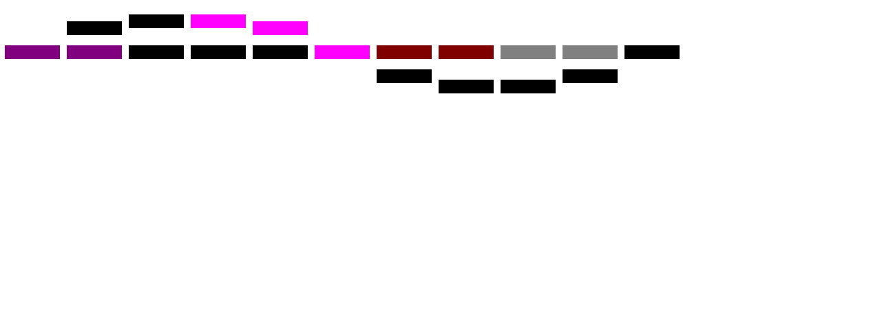

# Test_task_station

My test task on C++ and Angular. It`s not complete yet)

Что бы увидеть код приложения необходимо открыть папку TEST SUBJ

Внутри находятся:

ang - frontend часть приложения вместе с Angular кодом

trainLogic_and_server - backend часть приложения с кодом на C++

## Запуск

На данный момент процедура запуска рабочей части задачи производится следующим образом:

(ВНИМАНИЕ) Перед запуском приложения следует убедиться что у вас установлен и работает сервер RabbitMQ с stomp плагином (<https://www.rabbitmq.com/stomp.html>), а так же в том что порт 5672, а так же порт 15674, свободны.

1. Перейти в директорию .\Test_task_station\TEST SUBJ\ang\src\app
2. Открыть командную строку/строку PowerShell, после чего выполнить ng serve
3. Перейти в директорию .\Test_task_station\TEST SUBJ\trainLogic_and_server\Release
4. Запустить прилоежние trainLogic_and_server.exe

### Результаты работы

